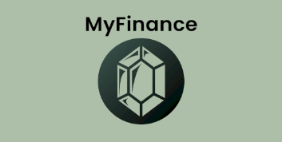

# MyFinance App Backend (Pre-alpha)

MyFinance App is a self-hosted Flutter-based application designed to work with [MyFinance Client Mobile](https://github.com/sonnguyen9800/MyFinance_Client_Mobile). The app is a expense tracker app. Used for scenarios of multiple users (multiple accounts) and the the usecase is for small family.

**Warning:** The app is still under ongoing development, multiple features are still being added. Please be patient and check back for updates.



## Features

The app currently supports the following features:

* CRUD Expense
* Signin/Signup
* Category CRUD
* Assign expense to Category Group
* Viewing last expenses

## Roadmap

The app is still under development and we promise to update more features in the future, including:
* Graph and Chart (Statistics)
* Family Management
* Budget Management
* Income and Saving Management

## Getting Started
No matter what solutions you follow, you must prepare a `.env` file.Whatever method you use, the `.env` file must be in the same folder as the `executable file` or `docker compose` file.

### Prepare a .env file
```
# .env
APP_ENV=development # use whatever you want
DATABASE_URL=mongodb://mongodb:27017 
DATABASE_NAME=MyFinance_Dev # use whatever you want
JWT_SECRET=your-dev-secret-key # use whatever you want

# Collection Names (optional, will use defaults if not set)
COLLECTION_USERS=users
COLLECTION_EXPENSES=expenses
COLLECTION_CATEGORIES=categories
COLLECTION_TAGS=tags
```


### Using Docker Compose (Recommended)

A Sample docker-compose for the setup

```
version: '3.8'
services:
  my-finance-backend:
    container_name: my_finance_backend
    image: sonnguyen9800/my-finance-backend:latest
    ports:
      - "8088:8080"
    env_file:
      - .env
    depends_on:
      - mongodb
    networks:
      - finance-network

  mongodb:
    image: mongo:latest
    container_name: mongodb
    ports:
      - "27018:27017" # 
    volumes:
      - mongodb-data:/data/db
    environment:
      - MONGO_INITDB_DATABASE=financedb
      - MONGO_INITDB_ROOT_USERNAME=${MONGO_ROOT_USERNAME}
      - MONGO_INITDB_ROOT_PASSWORD=${MONGO_ROOT_PASSWORD}
    networks:
      - finance-network

volumes:
  mongodb-data:

networks:
  finance-network:
    driver: bridge

```

#### Note:
- The above docker-compose file assumes that you have a `.env` file in the same folder
- The above docker-compose file has a `mongodb` container, which expose to `27018` port, which is **NOT** the default port of `mongodb` (27017). Oftenly, this is because my host machine already has a `mongodb` service running at `27017`. 

### Run from Executable file (Window)
1. Download the executable file from the releases page
2. Run the executable file


### Build from Source Code

0. Having `MongoDB` installed (preferably in a container or using `MongoDB Compass`)
1. Clone the repo
2. `go run .\main.go .\database_define.go` (without building the binary)
3. If you want to build the binary, run `go build`


## Acknowledgements

- [Go](https://golang.org/)
- [MongoDB](https://www.mongodb.com/)
- The icon of the app is created by game-icons.net (*Rupee* icon by **Delapouite** under *CC BY 3.0*)
- Windsurf Editor